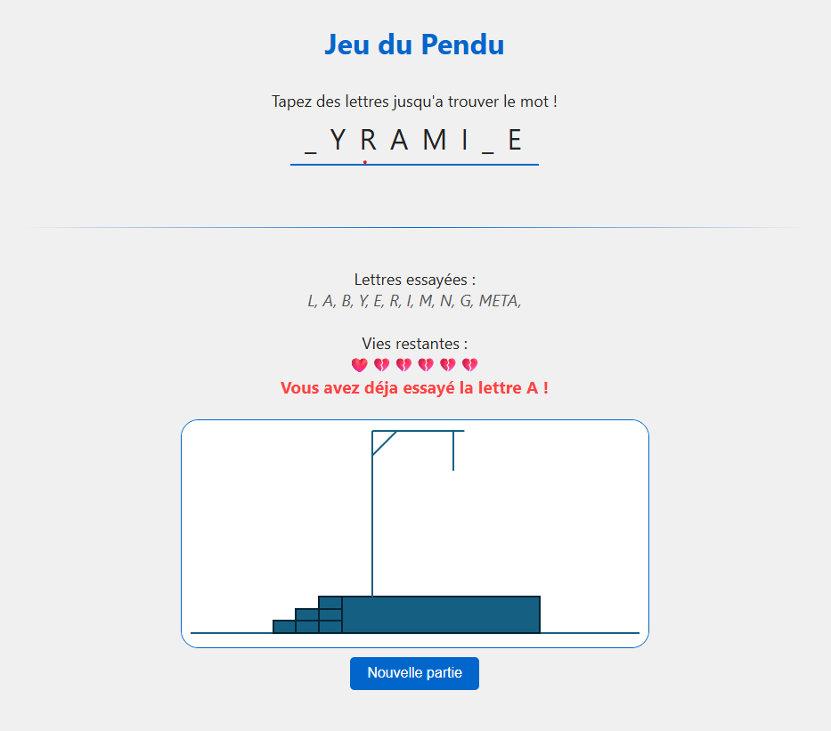

# Hangman Game (JS)

A hangman game running locally in JavaScript.

## Intro
This project was created after my training at Holberton School as a way to practice JavaScript and review some front-end concepts on my own, including DOM manipulation.
I developed it in a particular environment (office setup without admin rights) that didn’t allow me to run a server, hence a small workaround to make it run locally only.

## Feature
- Playable directly in the browser
- Word library in **French** (approx 100 words)
- Visual life system (with heart, and with small drawings)
- Visual effect if game over or victory

## Preview
Here is a quick preview of the game:




## Getting started
1 - Clone the repository
```bash
git clone https://github.com/OursBlanc42/hangman-js.git
cd hangman-js
```
You can also download it

2 - Open index.html in your favorite browser
3 - Enjoy

## Project structure
```
.
|   hangman.js
|   index.html
|   LICENSE
|   styles.css
|   wordLibrary.js
|
\---img
        0b.png
        1b.png
        2b.png
        3b.png
        4b.png
        5b.png
        6b.png
        test.png
```

## Todo / Ideas
- Add difficulty selection (easy / medium / hard)
- Show the answer when the game is over
- Make the UI mobile responsive
- Option to add custom words with persistence
- Add language switch (English / French / others)
- Code improvements

## License
This project is licensed under CC BY-NC 4.0
(Attribution required, no commercial use).
See the LICENSE file
